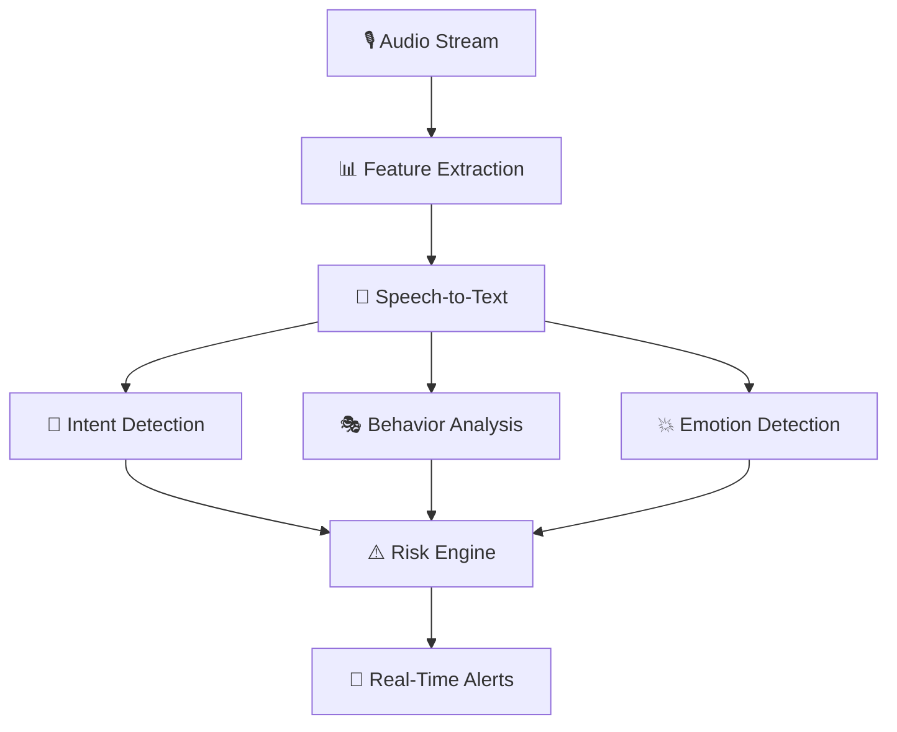

<!-- 🛡️ Wave Header -->


<!-- ⚡ Typing Animation -->
<p align="center">
  <b>🛡️ Real-Time Audio Fraud Detection • AI vs AI Defense • Conversation Intelligence</b>
</p>

---

# 🛡️ FemtoGuard – Team SheStorm  

<p align="center">
  
  
  
  
</p>

<p align="center">
  <b>Real-Time Audio Fraud Detection for Scam Prevention</b><br/>
  <i>Conversation Intelligence for the AI vs AI Era (2026)</i>
</p>

---

## 🌐 Live Demo

🔗 **App:**  
https://shestorm-ai-fraud-defender-73291669658.us-west1.run.app  

📂 **Demo + PPT:**  
https://drive.google.com/drive/folders/1y_DknpPaxDXdqYZMj07zlWCOonYMsOap  

---

## 👥 Team SheStorm

| Name | Role |
|------|------|
| Yamini | Frontend & UX |
| Ishani Gupta | Backend & APIs |
| Madhu Tiwari | AI / ML |
| Khushi Verma | Research & Testing |

---

## 🚨 Problem

Voice fraud has evolved into **AI-driven psychological manipulation**:

- 🎭 Voice cloning in seconds  
- 🤖 AI-driven scam conversations  
- 📞 Caller ID spoofing  
- 🧠 Emotional exploitation  

❌ Traditional systems ask:  
> “Is the voice fake?”

✅ We ask:  
> “Is the intent malicious?”

---

## 💡 Our Approach

FemtoGuard detects **fraud in real-time** by analyzing:

- 🧠 Intent  
- 🎭 Behavior  
- 💬 Conversation patterns  

📌 We don’t detect the caller — we detect the **conversation itself**.

---

## 🧠 Core Idea

### 🔄 Identity → Intent Shift

| Traditional Systems | FemtoGuard |
|--------------------|-----------|
| Who is calling? | Why are they calling? |
| Is voice real? | What are they asking? |
| Known number? | How are they manipulating? |

---

## 🔍 Detection Engine

### 1️⃣ Intent Detection
- Authority phrases (bank, officer)  
- Urgency cues (immediately, now)  
- Financial triggers (OTP, PIN)  
- Isolation tactics  

---

### 2️⃣ Behavioral Analysis
- Scripted speech patterns  
- Repetition loops  
- Interruptions  
- Dominant tone  

---

### 3️⃣ Emotional Manipulation
- Fear induction  
- Pressure tactics  
- Aggression mismatch  

📌 “Bank agent threatening user” = 🚨 High Risk  

---

## 🧠 AI Pipeline



---

## ⚙️ System Architecture

```text
Audio Input
   ↓
Feature Extraction
   ↓
Transcription
   ↓
Intent + Behavior + Emotion Analysis
   ↓
Risk Scoring
   ↓
User Alert System
```

---

## 📊 Before vs After Fraud Detection

### 🎯 Scenario: Scam Call Attempt

---

### ❌ Before (Traditional Systems)

**Call Transcript:**
> "Hello ma'am, I am calling from your bank. Your account will be blocked immediately. Please share your OTP to verify."

**System Response:**
- Caller ID: Unknown ❓  
- Voice: Human-like ✅  
- Blacklist match: ❌  

📌 **Result:** No alert  
🚨 **User Outcome:** High scam risk  

---

### ✅ After (FemtoGuard)

| Signal Type        | Detection |
|-------------------|----------|
| Authority Claim    | Bank detected |
| Urgency Cue        | Immediate |
| Financial Trigger  | OTP |
| Tone Analysis      | Aggressive |

```text
Risk Score: 92% (HIGH RISK)
```

🚨 **Alert:**
> ⚠️ "Potential scam detected. Do NOT share sensitive information."

---

### 💡 Impact

| Aspect | Before | FemtoGuard |
|-------|--------|-----------|
| Detection | Caller-based | Intent-based |
| Speed | Slow | Real-time |
| Accuracy | Low | High |
| Protection | ❌ | ✅ |

---

## 🛠 Tech Stack

### 🧠 AI / ML
- Speech features (MFCC, spectrogram)
- NLP / LLM models
- Real-time inference

### ⚙️ Backend
- FastAPI  
- WebSockets  
- REST APIs  

### 🎨 Frontend
- Live dashboard  
- Risk meter  
- Alerts  

### 🗄 Database
- PostgreSQL / SQLite  

---

## ✨ Key Features

- ⚡ Real-time fraud detection  
- 🔐 No prior enrollment  
- 🧠 AI + human scam detection  
- 🌍 Works on first call  
- 🔊 Noise tolerant  

---

## 🧪 Dataset

- Synthetic scam conversations  
- Multi-language support  
- Emotional variations  

---

## 🚀 Future Scope

- 📱 Mobile integration  
- 🌍 Multilingual support  
- 📡 Telecom deployment  
- 🧠 Deep learning upgrades  

---

## 🧑‍💻 Run Locally

```bash
npm install
```

Add API key in `.env.local`

```bash
npm run dev
```

---

## 🏁 Conclusion

> Voice fraud is not an audio problem.  
> It is a **human manipulation problem**.

🛡️ FemtoGuard acts as a **Real-Time Conversation Firewall**  
— stopping fraud *before damage happens.*

---

<!-- 🌊 Footer -->

